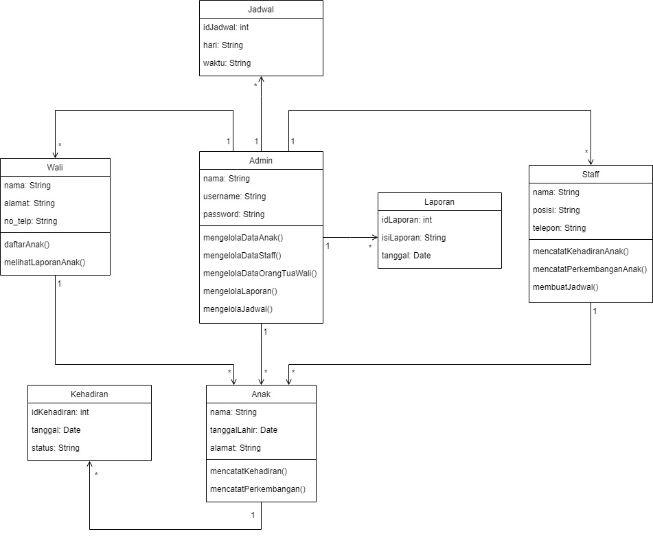

# Tugas Analisis Sistem Informasi Daycare Berbasis Objek

Nama: Afandi Ikhsyan Al Karim  
NPM: 4522210032  

## Latar Belakang

Daycare adalah layanan yang menyediakan perawatan dan pengawasan bagi anak-anak usia bayi hingga pra sekolah saat orang tua atau wali mereka bekerja ataupun memiliki keperluan lain. Layanan utama daycare secara garis besar meliputi:

- Penyediaan kebutuhan anak seperti makan, minum, tidur siang, dan mengganti popok.
- Menawarkan aktivitas bermain dan belajar yang sesuai dengan usia anak untuk mendukung perkembangan kognitif, fisik, sosial, dan emosional.
- Memastikan lingkungan yang aman dan terlindungi bagi anak-anak.
- Menyediakan makanan dan minuman yang sehat dan bergizi.
- Menjaga kebersihan lingkungan dan menerapkan praktik kesehatan yang baik untuk mencegah penyebaran penyakit.

## Tujuan Tugas

1. Menerapkan teknik analisis objek seperti use case, class diagram, dan ERD untuk memodelkan sistem informasi daycare.
2. Mengidentifikasi kebutuhan fungsional sistem.
3. Merancang solusi sistem informasi sesuai dengan kebutuhan daycare.

## Deskripsi Tugas

1. Pengelolaan data anak, orang tua/wali, staf, jadwal, kehadiran, dan laporan.
2. Identifikasi aktor yang terlibat.
3. Gunakan teknik use case untuk memodelkan interaksi antara aktor dan sistem.
4. Gunakan class diagram untuk memodelkan struktur objek.
5. Gunakan ERD untuk memodelkan hubungan antara entitas dalam sistem.

## Diagram

### Class Diagram

### Entity-Relationship Diagram (ERD)

### Use Case Diagram

